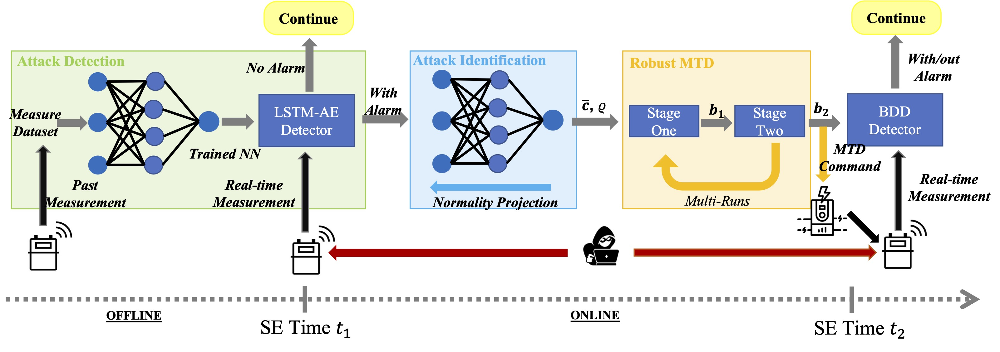

# DDET-MTD: Data-Driven Event-Triggered MTD against Power System FDI Attack

## Update
- 2022-12-21 This paper has been accepted by IEEE Transactions on Smart Grid. Copyright of the paper is reserved by IEEE.
- 2022-08-20 We update paper by adding more baseline experiment on event-triggered Max-Rank MTD and Robust-MTD. We open source the code for DDET-MTD.

## Citation
Please cite our paper if you find it useful for your research.

@article{xu2022blending,
  title={Blending Data and Physics Against False Data Injection Attack: An Event-Triggered Moving Target Defence Approach},
  author={Xu, Wangkun and Higgins, Martin and Wang, Jianhong and Jaimoukha, Imad M and Teng, Fei},
  journal={arXiv preprint arXiv:2204.12970},
  year={2022}
}

## Summary

This repo contains all the codes and data for DDET-MTD: Data-Driven Event-Triggered MTD against Power System FDI Attack for our paper [Blending Data and Physics Against False Data Injection Attack: An Event-Triggered Moving Target Defence Approach](https://arxiv.org/abs/2204.12970), coauthoered by [Wangkun Xu](https://scholar.google.com/citations?user=-RuGgBoAAAAJ&hl=en), [Martin Higgins](https://scholar.google.com/citations?user=I2cbZoAAAAAJ&hl=en), [Jianhong Wang](https://scholar.google.co.uk/citations?user=K1FKF3IAAAAJ&hl=zh-CN), [Imad. M. Jaimoukha](https://scholar.google.co.uk/citations?user=zzIhI_YAAAAJ&hl=en), and [Fei Teng](https://scholar.google.co.uk/citations?user=aOTMH1EAAAAJ&hl=en). 

## Abstract

Fast and accurate detection of cyberattacks is a key element for a  cyber-resilient  power system. Recently, data-driven detectors and physics-based Moving Target Defences (MTD) have been proposed to detect false data injection (FDI) attacks on state estimation. However, the uncontrollable false positive rate of the data-driven detector and the extra cost of frequent MTD usage limit their wide applications. Few works have explored the overlap between these two areas. To fill this gap, this paper proposes blending data-driven and physics-based approaches to enhance the detection performance. To start, a physics-informed data-driven attack detection and identification algorithm is proposed. Then, an MTD protocol is triggered by the positive alarm from the data-driven detector. The MTD is formulated as a bilevel optimisation to robustly guarantee its effectiveness against the worst-case attack around the identified attack vector. Meanwhile, MTD hiddenness is also improved so that the defence cannot be detected by the attacker. To guarantee feasibility and convergence, the convex two-stage reformulation is derived through duality and linear matrix inequality. The simulation results verify that blending data and physics can achieve extremely high detection rate while simultaneously reducing the false positive rate of the data-driven detector and the extra cost of MTD. All codes are available at https://github.com/xuwkk/DDET-MTD.



The proposed DDET-MTD has three successive components in one execution cycle. 

First, the LSTM-AE detector is trained on the normal dataset offline and then applied on the sensor measurement collected from SCADA in real-time operation. If a positive alarm is raised when solving the state estimation at time $t_1$, an attack identification algorithm is implemented to approximately extract the attack vector in the second component using the same neural network model. The attack identification serves as the bridge between the data and physics by applying the extracted attack knowledge to the MTD design, in the meantime, reduce the execution cost of MTD and improve its hiddenness. Physics information is also considered so that the identified attack can bypass the BDD. 

In the last component, based on the identified attack, a robust MTD algorithm is triggered to verify the positive alarm from the LSTM-AE detector at the next state estimation time $t_2$. Intuitively, the false alarms from the data-driven detector can be sufficiently rejected by the subsequent MTD. 

## Package

The key packages used in this project are:

- [PyPower](https://github.com/rwl/PYPOWER) for power system operations.  **PYPOWER** is a power flow and Optimal Power Flow (OPF) solver. It is a port of [MATPOWER](http://www.pserc.cornell.edu/matpower/) to the [Python](http://www.python.org/) programming language.
- [PyTorch](https://pytorch.org/) constructing deep learning detector. PyTorch is an open source machine learning framework that accelerates the path from research prototyping to production deployment.
- [CVXPY](https://www.cvxpy.org/) for solving convex MTD optimization problem. CVXPY is an open source Python-embedded modeling language for convex optimization problems. It lets you express your problem in a natural way that follows the math, rather than in the restrictive standard form required by solvers. This package is free to use.
- [MOSEK](https://www.mosek.com/) is a software package for the solution of linear, mixed-integer linear, quadratic, mixed-integer quadratic, quadratically constraint, conic and convex nonlinear mathematical optimization problems. The applicability of the solver varies widely and is commonly used for solving problems in areas such as engineering, finance and computer science ([source](https://en.wikipedia.org/wiki/MOSEK)). It is used to accurately and fast solve the convex SDP in hidden-effective MTD. Academic licenses are available for academic institutions and research institutions.

## Content

The main structure of this repo is summarised as follows:

```
.
├── configs                   
│   ├── config.py                   # cases, OPF, SE, and MTD configurations
│   ├── config_mea_idx.py           # sensor deployment and measurement noise configurations
│   └── nn_setting.py               # hyperparameters for neural network
├── utils                   
│   ├── class_se.py                 # class to support fundamental power system operation such as OPF, SE, and Max-Rank MTD
│   ├── fdi_att.py                  # functions to generate false data injection attack
│   └── load_data.py                # convenient methods to return case, data, and dataloader
├── figures                   
│   └── case14.png                  # figures for case14 system
├── gen_data                  
│   ├── case14                      # simulated measurements and states for the case14 system
│   ├── raw_data                    # the raw load and PV profiles
│   └── gen_data.py                 # functions to modify the IEEE standard case and generate the data 
├── metric
│   └── case14                      # metrics for the case14 system
├── models
│   ├── dataset.py                  # torch dataset and dataloader
│   ├── early_stopping.py      
│   ├── model.py                    # torch LSTM-AE model
│   └── evaluation.py               # functions to detect and identify attacks using LSTM-AE
└── optim
│   ├── optimization.py             # functions for the two-stage MTD optimisation and its evaluation methods.
│   └── robust_mtd.py               # functions for the baseline robust MTD
└── repo_figure
│── saved_model
│   └── checkpoint_rnn.pt           # trained LSTM-AE model for the case14 system
│── gen_load_pv.ipynb               # generate the load and pv profiles for the case14 system
│── test_jacobian.ipynb             # test the accuracy of approximation of effectiveness and hiddenness
│── evaluation_ddd.ipynb            # evaluate the performance of the data-driven (LSTM-AE) detector
│── evaluation_event_trigger.ipynb  # evaluate the performance of the DDET-MTD under attack
│── evaluation_fpr.ipynb            # evaluate the performance of the DDET-MTD with attack
│── evaluation_convergence.ipynb    # evaluate the convergence of the two-stage MTD optimisation
│── evaluation_baseline_no_attack.ipynb      # evaluate the baseline algorithms without attack
│── evaluation_baseline_with_attack.ipynb    # evaluate the baseline algorithms with attack
│── draw_metric.ipynb               # ipython notebook to draw all the figures in the paper
│── draw_profile.ipynb              # ipython notebook to draw the load and pv profiles
│── draw_metric.ipynb               # ipython notebook to draw all the figures in the paper
└── readme.md                       

```


> The fundamental algorithms, e.g. `class_se.py`, `fdi_att.py`, `gen_data.py` are copied from our repository [steady-state-power-system](https://github.com/xuwkk/steady-state-power-system). 

## Data

The only data needed for this repository is the raw load consumption and pv data where you can downloaded from [Google Drive](https://drive.google.com/drive/folders/1qe_sxsH_MZ3Z__rKgwx_dzPkozDuXjFq?usp=sharing). The load data is cleaned from [ElectricityLoadDiagrams20112014 Data Set](https://archive.ics.uci.edu/ml/datasets/ElectricityLoadDiagrams20112014) and the PV data is cleaned from [Elia](https://opendata.elia.be/pages/home/). After downloading, you should unzip the contents (`load.cav` and `pv.csv`) directly under folder `raw_data`.

## Data Preparation

### Load Data Generation

The load data generation is included in `gen_data/gen_data.py`:

1. **Clean Active and Reactive Load and PV**. We  use 4-month data in this project. The original 15min load and PV data are interpolated linearly into 5min resolution. To total length of load and PV data is 35136 (roughly 12x24x30x4) (see `gen_data/gen_data.py`).
2. **IEEE Case File**. Standard IEEE case files stored in [PyPower](https://github.com/rwl/PYPOWER/tree/master/pypower) is modified. For bus 14 system, we modify the standard case file from PyPower by adding load consumption on non reference bus, improving the load levels, reducing the branch power flow limit, and change the generator cost (see `gen_data/gen_data.py`).
3. **Construct Load and PV Suitable for Different Cases**. It is import that the OPF converges during each run. Therefore the load and PV levels are adjusted to be not too large.
   1. **Load**: Rescale the each of the raw load by the default load level in step 2. The reactive power is determined with randomly 0.97-0.99 power factor.
   2. **PV**: Rescale it by penetration level equals to 30%, meaning that the maximum total PV generation per 5min will be 30% of the maximum total load consumption. For the PV data, we add up to random reduction with a maximum probability to mimic the cloud.  Although the reactive power for PV is generated, but we don't use it any further. The PV is considered in restricted mode, meaning that no reactive power can be generated for voltage regulation.
4. **Measurement**. We consider RTU measurements including active and reactive power injections at all buses, from end active and reactive power flows at all branches. Instead of using the constant measurement noise, we run the AC Optimal Power Flow (OPF) on the default load condition in step 2 and calculate the std of noise as 2% for power measurements. To generate dataset of measurement for LSTM-AE, we run Optimal Power Flow under each 35136 load point and record the measurements and estimated states.

